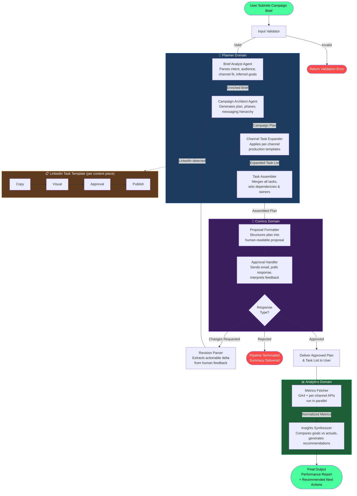
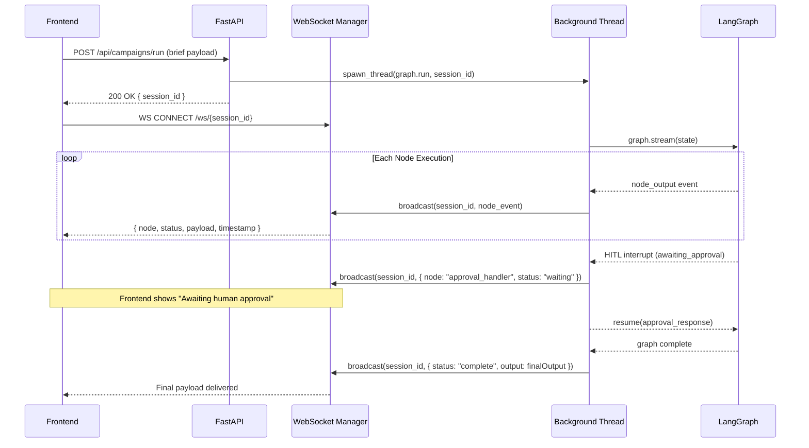

# MARA — Marketing Agentic Resource Assistant

> A multi-agent AI system that takes a marketing brief end-to-end: from campaign planning and human approval, through task assignment, to performance analytics — all streamed live via WebSocket.

---

## Table of Contents

- [Overview](#overview)
- [Agentic Workflow](#agentic-workflow)
- [Architecture](#architecture)
- [Folder Structure](#folder-structure)
- [Quick Start](#quick-start)
- [WebSocket Streaming](#websocket-streaming)
- [API Reference](#api-reference)
- [Agent Descriptions](#agent-descriptions)
- [Channel Task Templates](#channel-task-templates)
- [Environment Variables](#environment-variables)

---

## Overview

MARA automates the full marketing campaign lifecycle using a LangGraph-powered multi-agent pipeline. The system accepts a campaign brief, generates a structured campaign plan with channel-aware task breakdowns, routes it for human approval via email (with a revision loop), and finally produces a performance summary with recommended next actions.

The entire graph execution is streamed to the frontend via WebSocket, allowing real-time monitoring of each agent node as it runs.

---

## Agentic Workflow



---

## WebSocket Graph State Streaming



---

## Folder Structure

```
mara/
├── app/
│   ├── main.py                        # FastAPI app entry point
│   ├── api/
│   │   ├── __init__.py
│   │   ├── routes/
│   │   │   ├── __init__.py
│   │   │   ├── campaigns.py           # POST /campaigns/run, GET /campaigns/{id}
│   │   │   └── websocket.py           # WS /ws/{session_id}
│   │   └── dependencies.py            # Shared FastAPI dependencies
│   ├── core/
│   │   ├── __init__.py
│   │   ├── config.py                  # Settings via pydantic-settings
│   │   └── logging.py                 # Structured logging setup
│   ├── graph/
│   │   ├── __init__.py
│   │   ├── builder.py                 # LangGraph graph construction
│   │   ├── state.py                   # GraphState TypedDict
│   │   ├── edges.py                   # Conditional edge logic / routing
│   │   └── nodes/
│   │       ├── __init__.py
│   │       ├── input_validator.py
│   │       ├── brief_analyst.py
│   │       ├── campaign_architect.py
│   │       ├── channel_expander.py
│   │       ├── task_assembler.py
│   │       ├── proposal_formatter.py
│   │       ├── approval_handler.py
│   │       ├── revision_parser.py
│   │       ├── metrics_fetcher.py
│   │       └── insights_synthesizer.py
│   ├── services/
│   │   ├── __init__.py
│   │   ├── llm_service.py             # LLM client init, model selection
│   │   ├── email_service.py           # Gmail MCP / SMTP integration
│   │   ├── analytics_service.py       # GA4 API + channel metric clients
│   │   ├── websocket_manager.py       # Session WS connection registry
│   │   └── graph_runner.py            # Background thread runner + WS broadcaster
│   ├── schemas/
│   │   ├── __init__.py
│   │   ├── brief.py                   # CampaignBriefInput, EnrichedBrief
│   │   ├── campaign.py                # CampaignPlan, ContentPiece
│   │   ├── tasks.py                   # Task, TaskList, ChannelTaskGroup
│   │   ├── approval.py                # ApprovalRequest, ApprovalResponse
│   │   ├── analytics.py               # MetricsPayload, PerformanceReport
│   │   └── websocket.py               # WSEvent, WSNodeStatus
│   ├── prompts/
│   │   ├── __init__.py
│   │   ├── brief_analyst.py
│   │   ├── campaign_architect.py
│   │   ├── channel_expander.py
│   │   ├── proposal_formatter.py
│   │   ├── revision_parser.py
│   │   └── insights_synthesizer.py
│   └── utils/
│       ├── __init__.py
│       ├── channel_templates.py       # Channel → task template registry
│       └── state_helpers.py           # Graph state read/write helpers
├── .env.example
├── pyproject.toml
├── README.md
└── .gitignore
```

---

## Quick Start

```bash
# 1. Install dependencies
uv init & uv venv & uv source venv\bin\activate

# 2. Copy and fill environment variables
cp .env.example .env

# 3. Run the server
uvicorn app.main:app --reload --port 8000
```

---

## WebSocket Streaming

Connect to `ws://localhost:8000/ws/{session_id}` after receiving a `session_id` from the campaign run endpoint.

Each message is a JSON payload:

```json
{
  "session_id": "abc-123",
  "node": "brief_analyst",
  "status": "running | complete | error | waiting",
  "domain": "planner | comms | analytics",
  "payload": { },
  "iteration": 1,
  "timestamp": "2025-05-22T10:00:00Z"
}
```

---

## API Reference

| Method | Path | Description |
|--------|------|-------------|
| `POST` | `/api/campaigns/run` | Submit brief, start graph, return `session_id` |
| `GET` | `/api/campaigns/{session_id}` | Get current graph state snapshot |
| `POST` | `/api/campaigns/{session_id}/resume` | Inject approval response to resume HITL |
| `WS` | `/ws/{session_id}` | Stream real-time node events |

---

## Agent Descriptions

| Agent | Domain | Responsibility |
|-------|--------|---------------|
| Input Validator | Pre-graph | Schema validation of raw brief |
| Brief Analyst | Planner | Enriches brief with inferred goals, flags gaps |
| Campaign Architect | Planner | Generates campaign phases, messaging, content plan |
| Channel Expander | Planner | Expands each content piece into channel-specific task templates |
| Task Assembler | Planner | Merges all tasks, sets dependencies and suggested owners |
| Proposal Formatter | Comms | Formats plan into structured, readable proposal |
| Approval Handler | Comms | Sends email, polls response, interprets and routes feedback |
| Revision Parser | Comms | Extracts structured revision delta from free-text feedback |
| Metrics Fetcher | Analytics | Parallel fetch from GA4 and channel APIs |
| Insights Synthesizer | Analytics | Compares goals vs actuals, produces recommendations |

---

## Channel Task Templates

| Channel | Task Sequence |
|---------|--------------|
| LinkedIn | Copy → Visual → Approval → Publish |
| Email | Copy → HTML Build → QA/Test → Approval → Send |
| Instagram | Visual → Copy → Approval → Publish |
| Paid Search | Ad Copy → Audience Setup → Bid Strategy → Approval → Launch |

---

## Environment Variables

```env
# LLM
ANTHROPIC_API_KEY=

# Email
GMAIL_MCP_SERVER_URL=
APPROVAL_EMAIL_RECIPIENT=

# Analytics
GA4_PROPERTY_ID=
GOOGLE_APPLICATION_CREDENTIALS=

# App
APP_ENV=development
LOG_LEVEL=INFO
MAX_REVISION_ITERATIONS=5
```
